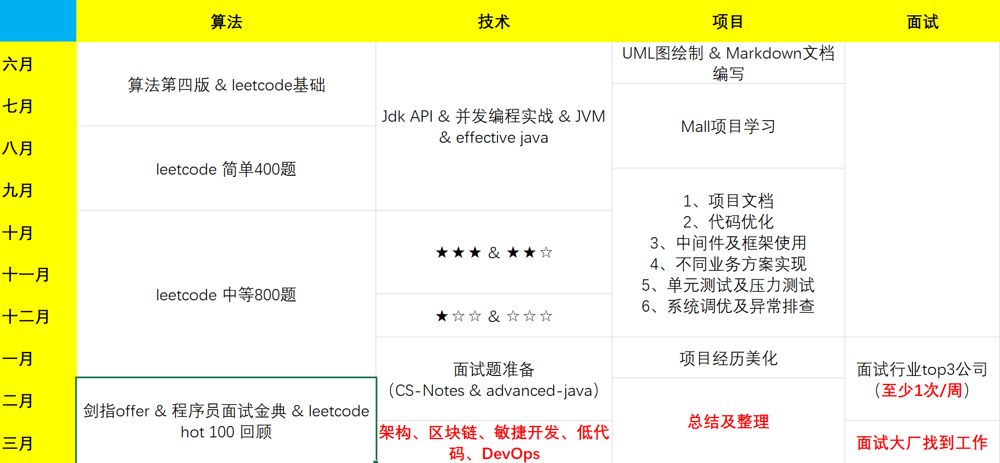

## [首页](https://kingkh1995.github.io/blog/)

### 学习清单

- ★★★ Java
- ★★★ Spring
- ★★★ Spring Boot
- ★★★ Spring Cloud
- ★★★ Dubbo
- ★★★ MySQL
- ★★★ Redis
- ★★★ Netty
- ★★☆ Mybatis
- ★★☆ Spring Data JPA
- ★★☆ RocketMQ
- ★★☆ Kafka
- ★★☆ Zookeeper
- ★★☆ Quartz
- ★☆☆ Sharding-JDBC
- ★☆☆ ES
- ★☆☆ Sentinel
- ★☆☆ Spring Security
- ☆☆☆ Shiro
- ☆☆☆ Redisson
- ☆☆☆ ELK
- ☆☆☆ Cat
- ☆☆☆ Nacos
- ☆☆☆ Maven
- ☆☆☆ Tomcat
- ☆☆☆ Jenkins
- ☆☆☆ Seata
- ☆☆☆ Canal
- ☆☆☆ Nginx

### 书籍清单

- 《算法（第 4 版）》
- 《图解HTTP》
- 《深入理解 Java 虚拟机（第 3 版）》
- 《Java并发编程实战》
- [《深入浅出Java多线程》] (https://redspider.gitbook.io/concurrent/)
- 《Java 8 实战》
- 《Effective Java（第 3 版）》
- 《码出高效 Java 开发手册》
- 《高性能 MySQL 第三版》
- 《MySQL 技术内幕：InnoDB 存储引擎》
- 《Redis 开发与运维》
- 《Redis 深度历险：核心原理和应用实践》
- 《Netty进阶之路》
- 《从Paxos到Zookeeper 分布式一致性原理与实践》
- 《互联网轻量级SSM框架解密》
- 《重构 改善既有代码的设计》
- 《代码整洁之道》
- 《领域驱动设计》