---
tags:
  - LLM
  - AI
  - 术语
  - 入门
created: 2026-04-08
description: 用通俗易懂的语言，系统梳理大语言模型领域的核心专业术语，从基础概念到前沿技术一网打尽。
---

# 一文读懂大模型专业术语

> [!info] 阅读指南
> 本文面向希望系统了解大语言模型（LLM）技术体系的读者。所有术语均配有通俗解释、类比说明和可视化图表。建议按顺序阅读，也可通过目录跳转到感兴趣的章节。

## 目录

- [[#一、全局视野：大模型从哪里来，到哪里去]]
- [[#二、基础概念篇——先搞懂这些词]]
- [[#三、模型架构篇——Transformer 的世界里有什么]]
- [[#四、训练流程篇——模型是怎么被「教」出来的]]
- [[#五、推理与生成篇——模型是怎么「说话」的]]
- [[#六、提示词工程篇——如何跟模型高效沟通]]
- [[#七、微调与高效训练篇——如何低成本定制模型]]
- [[#八、检索增强与智能体篇——给模型装上「外挂」]]
- [[#九、评估与安全篇——怎么判断模型好不好]]
- [[#十、部署与优化篇——模型怎么上线服务]]
- [[#十一、前沿方向篇——未来在发生什么]]

---

## 一、全局视野：大模型从哪里来，到哪里去

在深入每个术语之前，先建立全局观。下面这张图展示了一个大模型从「诞生」到「上岗」的完整生命周期：

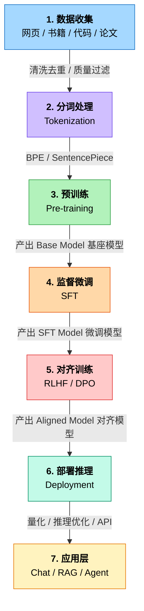

下面我们按照这条流水线，逐环节拆解其中的核心术语。

---

## 二、基础概念篇——先搞懂这些词

### 2.1 Token（词元）

> **一句话解释**：**Token** 是模型处理文本的最小单位，可以粗略理解为「分词后的一个片段」。

Token 不是字，也不是词，而是介于两者之间的一种单位。不同模型的分词方式不同：

- 英文中：`"unbelievable"` 可能被分为 `["un", "believ", "able"]` 三个 Token
- 中文里：`"大语言模型"` 可能被分为 `["大", "语言", "模型"]` 或 `["大语", "言", "模型"]`，取决于分词器

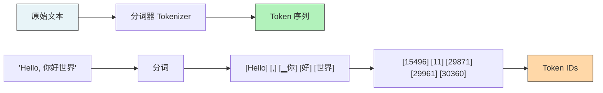

> [!tip] 经验法则
> 1 个中文字 ≈ 1~2 个 Token；1 个英文单词 ≈ 1~1.5 个 Token。
> GPT-4 的 Tokenizer 中，100 Token 大约对应 75 个英文单词或 50 个中文字。

### 2.2 Embedding（嵌入 / 向量表示）

> **一句话解释**：**Embedding** 把每个 Token 映射成一个高维数字向量，让模型能够「理解」词语之间的语义关系。

把词语想象成地图上的点——语义相近的词在地图上距离也近。

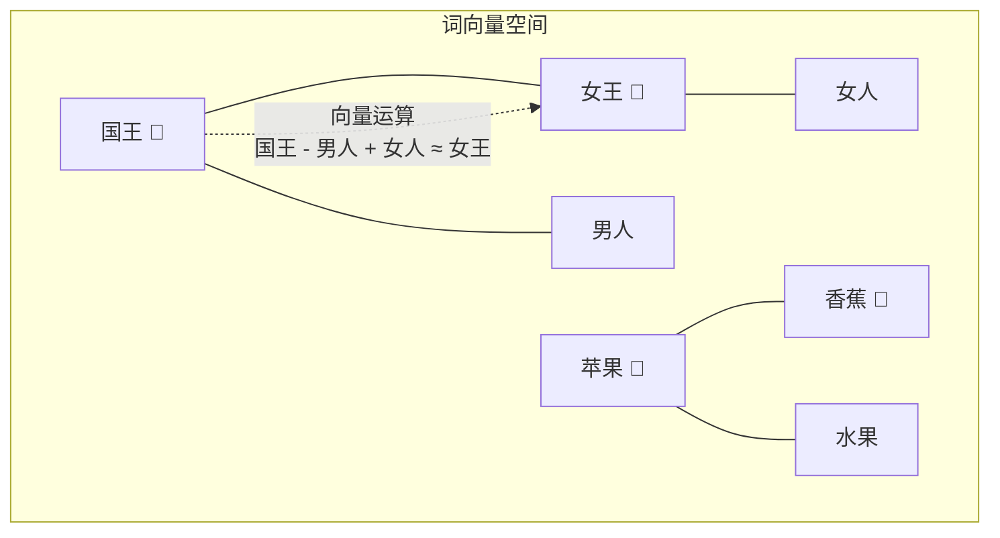

Embedding 的维度通常在 768 到 12288 之间，取决于模型大小。这些数字本身没有直观含义，但它们编码了丰富的语义信息。

### 2.3 Parameters（参数量）

> **一句话解释**：**Parameters** 是模型内部的「旋钮」，训练过程就是调整数十亿个旋钮，让模型的输出越来越准确。

| 模型规模 | 参数量级 | 类比 |
|---------|---------|------|
| 小模型 | < 1B（十亿） | 一个小学生的知识量 |
| 中模型 | 1B ~ 10B | 一个大学生的知识量 |
| 大模型 | 10B ~ 100B | 一个专家团队的知识量 |
| 超大模型 | 100B+ | 整个研究院的集体智慧 |

常见的参数量表示法：
- **B** = Billion = 十亿（如 7B = 70 亿参数）
- **M** = Million = 百万
- **T** = Trillion = 万亿（目前尚未有单个模型达到）

### 2.4 Context Window（上下文窗口）

> **一句话解释**：**Context Window** 是模型一次能「看到」的文本长度上限，好比一个人的「工作记忆」容量。

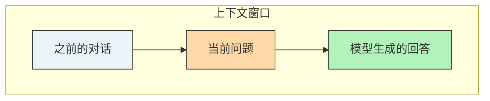

| 模型 | 上下文窗口 |
|------|-----------|
| GPT-3.5 | 4K / 16K Token |
| GPT-4o | 128K Token |
| Claude 3.5 | 200K Token |
| Gemini 1.5 Pro | 1M ~ 2M Token |
| Kimi / 通义千问 | 最高支持 200K+ |

> [!note] 注意
> 上下文窗口越大 ≠ 效果越好。模型对超长文本中间部分的信息容易「遗忘」，这被称为 **Lost in the Middle** 效应。

### 2.5 Vocabulary（词表）

> **一句话解释**：**Vocabulary** 是分词器能识别的所有 Token 的集合，相当于模型的「字典」。

- GPT-4 的词表大小约 100,278 个 Token（BPE 分词）
- LLaMA 3 的词表大小为 128,256 个 Token
- 词表越大，对多语言和特殊符号的支持通常越好

---

## 三、模型架构篇——Transformer 的世界里有什么

### 3.1 Transformer

> **一句话解释**：**Transformer** 是当前几乎所有大模型的「心脏」——一种基于注意力机制的神经网络架构，2017 年由 Google 在论文《Attention Is All You Need》中提出。

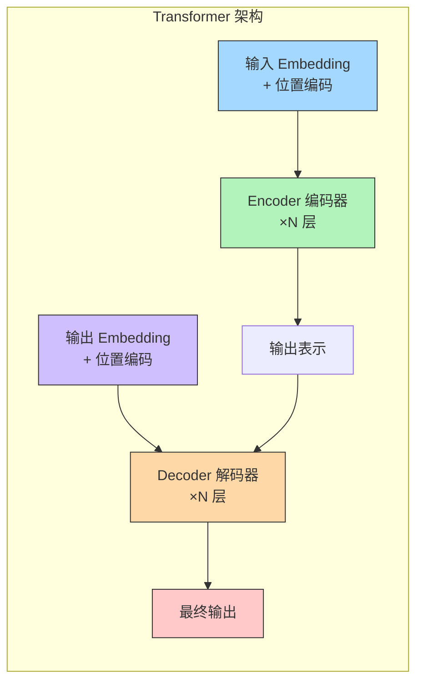

Transformer 的发展分出两条主线：

| 路线 | 代表模型 | 特点 |
|------|---------|------|
| **Encoder-Only** | BERT、RoBERTa | 只用编码器，擅长理解任务（分类、抽取） |
| **Decoder-Only** | GPT 系列、LLaMA | 只用解码器，擅长生成任务（对话、写作） |
| **Encoder-Decoder** | T5、BART | 两者都用，擅长序列到序列任务（翻译、摘要） |

> 当前主流大模型（GPT-4、Claude、Gemini、DeepSeek）几乎全部采用 **Decoder-Only** 架构。

### 3.2 Self-Attention（自注意力机制）

> **一句话解释**：**Self-Attention** 让模型在处理一个词时，能够「回头看看」句子中所有其他词，决定每个词对自己有多重要。

```mermaid
flowchart LR
    subgraph 句子: "猫坐在垫子上，因为它很暖和"
        C["猫"] -->|"强关注"| I["它"]
        D["垫子"] -->|"强关注"| I
        Z["坐"] -->|"弱关注"| I
    end
    I["'它'指的是谁？<br>→ 猫 or 垫子？"]
    style I fill:#ffc9c9,stroke:#e03131
    style C fill:#a5d8ff,stroke:#333
    style D fill:#b2f2bb,stroke:#333
```

**Attention 计算**的核心公式：`Attention(Q, K, V) = softmax(QK^T / √d) × V`

用通俗的话说：
- **Q（Query）**：当前词发出的「查询」——「我在找什么信息？」
- **K（Key）**：每个词提供的「标签」——「我能提供什么信息？」
- **V（Value）**：每个词包含的「内容」——「我的具体信息是什么？」

### 3.3 Multi-Head Attention（多头注意力）

> **一句话解释**：**Multi-Head Attention** = 多组 Q/K/V 同时计算注意力，让模型从不同角度理解文本。

类比：就像读书时有 8 个人同时阅读，每个人关注不同方面（有人关注语法，有人关注情感，有人关注逻辑），最后把所有人的理解汇总。

### 3.4 Positional Encoding（位置编码）

> **一句话解释**：因为 **Transformer** 本身没有「顺序」概念，**Positional Encoding** 给每个 Token 贴上「位置标签」，让模型知道词的先后顺序。

主流位置编码方案：

| 方案 | 使用者 | 特点 |
|------|--------|------|
| 正弦编码 | 原始 Transformer | 固定的数学函数 |
| RoPE（旋转位置编码） | LLaMA、Qwen | 支持外推，目前最主流 |
| ALiBi | BLOOM、MPT | 通过距离惩罚实现位置感知 |

### 3.5 FFN / MLP（前馈网络）

> **一句话解释**：每一层 **Transformer** 中，**Attention** 机制负责「收集信息」，**FFN / MLP** 负责「加工存储信息」——可以理解为模型的「记忆模块」。

近年来 FFN 也发展出了多种变体：

- **GLU（Gated Linear Unit）**：引入门控机制，提升性能（SwiGLU 是目前最流行的激活函数）
- **MoE（Mixture of Experts）**：把一个大 FFN 拆成多个小 FFN（专家），每次只激活少数几个（详见 [[#7.5 MoE（混合专家模型）]]）

---

## 四、训练流程篇——模型是怎么被「教」出来的

### 4.1 Pre-training（预训练）

> **一句话解释**：**Pre-training** 就是让模型「博览群书」——用海量无标注文本让模型学会预测下一个 Token。

这是整个训练过程中最耗资源的阶段：

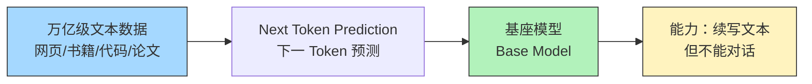

**训练目标**：给定前面的 Token，预测下一个 Token 的概率分布。

**关键数字参考**：
- GPT-3：300B Token 训练数据
- LLaMA 2：2T Token
- LLaMA 3：15T+ Token

### 4.2 SFT（Supervised Fine-Tuning，监督微调）

> **一句话解释**：预训练后的模型只会「续写」，**SFT** 教它学会「听指令、给回答」。

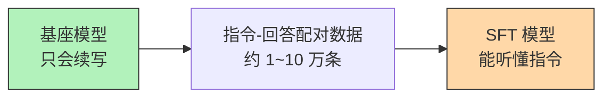

SFT 数据示例：
```
用户: 请用三句话介绍太阳系。
助手: 太阳系是以太阳为中心的行星系统，包含八大行星。
地球是太阳系中第三颗行星，也是目前唯一已知存在生命的星球。
木星是太阳系中最大的行星，其质量超过其他所有行星的总和。
```

### 4.3 RLHF（Reinforcement Learning from Human Feedback，基于人类反馈的强化学习）

> **一句话解释**：**RLHF** 让模型学会「什么回答更好」——通过人类偏好评分来训练一个奖励模型，再用强化学习优化大模型。

```mermaid
flowchart TB
    subgraph 第一步：训练奖励模型
        P["同一问题的多个回答"] --> H["人类标注偏好<br>A > B > C"]
        H --> RM["奖励模型<br>Reward Model"]
    end
    subgraph 第二步：强化学习优化
        SFT["SFT 模型"] --> G["生成回答"]
        G --> RM
        RM --> R["给出奖励分数"]
        R --> UP["更新模型策略<br>PPO 算法"]
    end
    style RM fill:#ffc9c9,stroke:#e03131
    style SFT fill:#ffd8a8,stroke:#333
```

### 4.4 DPO（Direct Preference Optimization，直接偏好优化）

> **一句话解释**：**DPO** 是 **RLHF** 的简化版——跳过奖励模型，直接用人类偏好数据优化大模型，训练更简单更稳定。

| 对比项 | RLHF | DPO |
|--------|------|------|
| 是否需要奖励模型 | 需要 | 不需要 |
| 训练复杂度 | 高（需要 4 个模型） | 低（只需 1 个模型） |
| 稳定性 | 需要仔细调参 | 更稳定 |
| 效果 | 成熟可靠 | 已接近甚至超越 RLHF |

DPO 的出现（2023 年）大大降低了训练对齐模型的门槛。之后又涌现出许多变体：
- **IPO**：更稳健的偏好优化
- **KTO**：只需要好/坏标签，不需要成对偏好
- **ORPO**：将 SFT 和偏好优化合二为一
- **SimPO**：简化 DPO，无需参考模型

### 4.5 PPO（Proximal Policy Optimization，近端策略优化）

> **一句话解释**：**PPO** 是 **RLHF** 中使用的强化学习算法，负责根据奖励分数更新模型参数，同时防止更新幅度过大导致模型「崩溃」。

---

## 五、推理与生成篇——模型是怎么「说话」的

### 5.1 自回归生成（Autoregressive Generation）

> **一句话解释**：**Autoregressive Generation** 是大模型生成文本的方式——「一个一个 Token 往后蹦」，每次根据前面所有的 Token，预测下一个最可能的 Token。

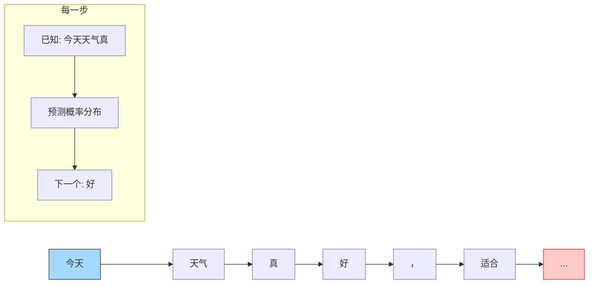

### 5.2 Temperature（温度）

> **一句话解释**：**Temperature** 控制模型生成的「创造性」——温度越低越保守精确，温度越高越天马行空。

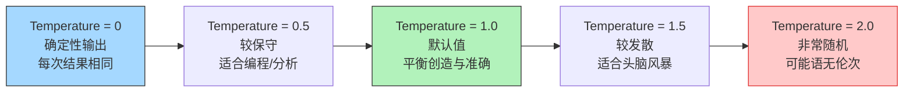

数学原理：温度 T 作用于 softmax 函数 `softmax(logits / T)`。T 越小，概率分布越尖锐（集中于高概率选项）；T 越大，概率分布越平坦（各选项概率趋于平均）。

### 5.3 Top-K 采样

> **一句话解释**：**Top-K** 就是只从概率最高的 K 个 Token 中随机选一个，其余的全部忽略。

例如 Top-K = 50，意味着每一步只在排名前 50 的候选 Token 中采样。

### 5.4 Top-P（Nucleus Sampling，核采样）

> **一句话解释**：**Top-P（Nucleus Sampling）** 不是选固定个数，而是选概率之和刚好超过 P 的那些 Token。

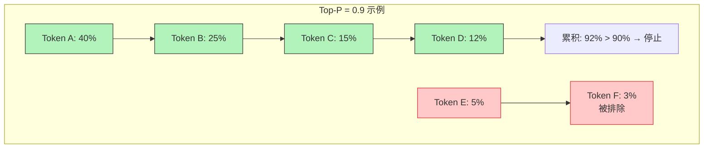

实际使用中，通常 **同时设置 Top-K 和 Top-P**，取两者的交集。

### 5.5 KV Cache（键值缓存）

> **一句话解释**：**KV Cache** 把之前算过的注意力 Key 和 Value 缓存起来，避免每生成一个新 Token 都重新计算全部历史——这是推理加速的关键技术。

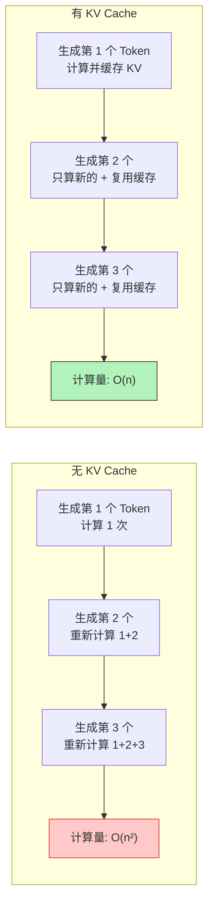

### 5.6 Speculative Decoding（投机解码）

> **一句话解释**：**Speculative Decoding** 用一个小模型「打草稿」生成多个 Token，然后让大模型一次性验证这些 Token 是否正确，从而加速推理。

### 5.7 Beam Search（束搜索）

> **一句话解释**：**Beam Search** 是每一步保留概率最高的 N 条候选路径（beam），最终选择总概率最高的完整序列。比贪心搜索更全局最优，但比采样更确定。

### 5.8 Reasoning / Thinking Tokens（推理 / 思考 Token）

> **一句话解释**：**Reasoning Tokens** 是模型在给出最终回答前「内心独白」的中间步骤，用户通常看不到但会计入 Token 消耗。

这是 OpenAI o1/o3、DeepSeek-R1 等推理模型引入的新概念。模型先「思考」（生成推理链），再输出答案。

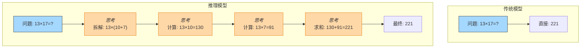

---

## 六、提示词工程篇——如何跟模型高效沟通

### 6.1 Prompt（提示词）

> **一句话解释**：**Prompt** 就是你发给模型的输入文本——你的问题、指令或任何需要模型处理的内容。

### 6.2 System Prompt（系统提示词）

> **一句话解释**：**System Prompt** 是在对话开始前预设的「人设」和「规则」，告诉模型应该扮演什么角色、遵循什么约束。

```
System: 你是一位资深 Python 工程师。回答要简洁、给出代码示例，避免冗长解释。
User: 如何读取 CSV 文件？
```

### 6.3 Zero-shot（零样本）

> **一句话解释**：**Zero-shot** 是不给任何示例，直接让模型完成任务。

```
用户：请将以下文本翻译为英文：今天天气真好。
```

### 6.4 Few-shot（少样本）

> **一句话解释**：**Few-shot** 是在 **Prompt** 中给几个示例，让模型「照猫画虎」。

```
用户：
苹果 → 水果
白菜 → 蔬菜
牛肉 → ？
```

### 6.5 Chain-of-Thought（CoT，思维链）

> **一句话解释**：**Chain-of-Thought（CoT）** 让模型「一步一步思考」，把推理过程展示出来，而不是直接给答案。

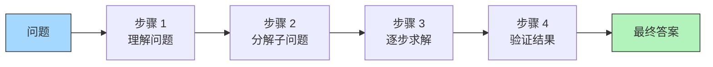

经典的触发方式：在 Prompt 末尾加上 `Let's think step by step.`

### 6.6 Tree-of-Thought（ToT，思维树）

> **一句话解释**：**Tree-of-Thought（ToT）** 是 **CoT** 的升级版——不是一条线思考，而是生成多条推理路径，像树一样展开，然后评估选择最优路径。

### 6.7 ReAct（Reasoning + Acting）

> **一句话解释**：**ReAct** 让模型交替进行「思考推理」和「采取行动（调用工具）」，边想边做。

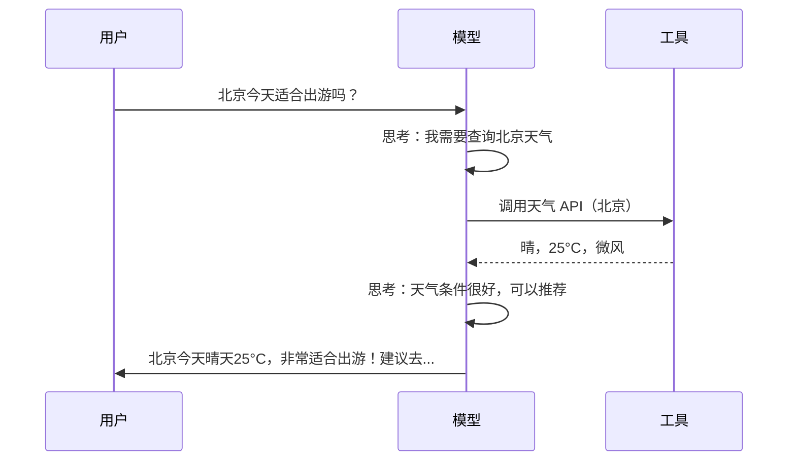

---

## 七、微调与高效训练篇——如何低成本定制模型

### 7.1 Fine-tuning（微调）

> **一句话解释**：**Fine-tuning（微调）** 是在预训练模型的基础上，用特定领域的数据继续训练，让模型在目标任务上表现更好。

### 7.2 LoRA（Low-Rank Adaptation，低秩适配）

> **一句话解释**：**LoRA** 不修改原始模型参数，而是旁边挂一个「小插件」（低秩矩阵），只训练这个小插件即可实现微调。

```mermaid
flowchart TB
    subgraph 原始权重 W（冻结不训练）
        W["W ∈ R^d×d<br>参数量: d×d"]
    end
    subgraph LoRA 旁路（只训练这部分）
        A["A ∈ R^d×r"] --> B["B ∈ R^r×d"]
        R["r << d<br>例如 r=8, d=4096"]
    end
    subgraph 计算过程
        X["输入 x"] --> M["xW + xAB"]
        M --> O["输出"]
    end
    style W fill:#a5d8ff,stroke:#333
    style A fill:#b2f2bb,stroke:#333
    style B fill:#b2f2bb,stroke:#333
```

| 对比 | 全量微调 | LoRA 微调 |
|------|---------|----------|
| 可训练参数 | 100% | 通常 < 1% |
| 显存需求 | 极高 | 低很多 |
| 训练速度 | 慢 | 快 |
| 效果 | 最佳 | 接近全量微调 |
| 多任务切换 | 需要多份完整模型 | 只需切换小插件 |

### 7.3 QLoRA（量化 LoRA）

> **一句话解释**：**QLoRA** = 量化 + **LoRA**。先把模型量化到 4-bit，再用 LoRA 微调，进一步降低显存需求。

> 用 QLoRA 可以在单张 24GB 显存的消费级 GPU 上微调 70B 参数的模型。

### 7.4 量化（Quantization）

> **一句话解释**：**Quantization** 把模型参数从高精度（如 16-bit 浮点数）压缩到低精度（如 4-bit 整数），用少量精度损失换取大幅的显存和速度优化。

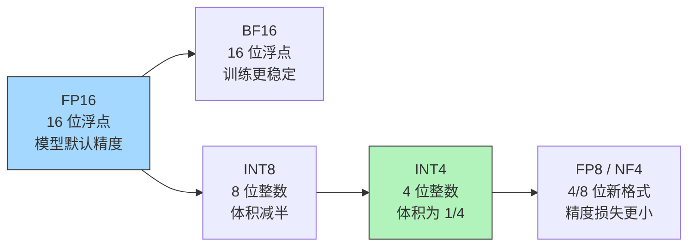

常见量化方案：
- **GPTQ**：训练后量化，适合推理
- **AWQ**：保护重要权重的量化，精度更好
- **GGUF**：llama.cpp 使用的量化格式，支持 CPU 推理
- **Bitsandbytes**：与 QLoRA 配合使用的量化库

### 7.5 MoE（Mixture of Experts，混合专家模型）

> **一句话解释**：**MoE** 把一个大模型拆成多个「专家」（小型 FFN），每次推理只激活少数几个专家，用「大模型的总参数」但只需「小模型的计算量」。

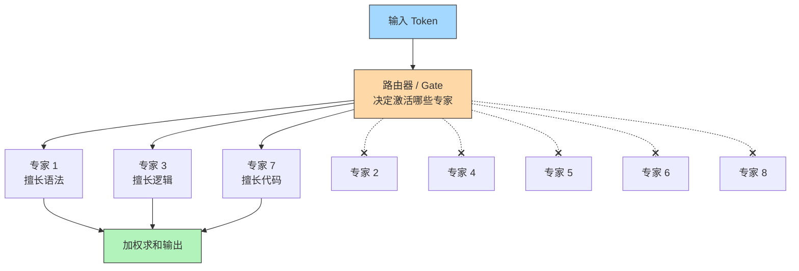

| 模型 | 总参数 | 激活参数 | 专家数 |
|------|--------|---------|--------|
| Mixtral 8x7B | 46.7B | 12.9B | 8 |
| DeepSeek-V3 | 671B | 37B | 256 |
| Qwen2.5-Max | 未公开 | 未公开 | MoE 架构 |

> MoE 是 2024-2025 年最重要的架构趋势之一，让模型在保持高性能的同时大幅降低推理成本。

### 7.6 知识蒸馏（Knowledge Distillation）

> **一句话解释**：**Knowledge Distillation** = 用一个大模型（教师）来训练一个小模型（学生），让小模型学到接近大模型的能力。

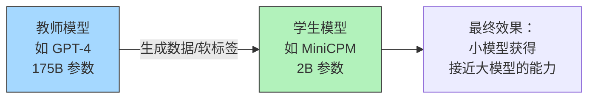

---

## 八、检索增强与智能体篇——给模型装上「外挂」

### 8.1 RAG（Retrieval-Augmented Generation，检索增强生成）

> **一句话解释**：**RAG** 就是让模型在回答问题前，先从外部知识库中搜索相关资料，然后基于检索到的资料来生成回答——解决模型知识过时和幻觉问题。

```mermaid
flowchart TB
    Q["用户提问"] --> R["检索器<br>从知识库搜索"]
    KB["外部知识库<br>文档/网页/数据库"] --> R
    R --> C["将检索结果拼入 Prompt"]
    C --> M["大模型<br>基于检索内容生成"]
    M --> A["回答"]
    style Q fill:#a5d8ff,stroke:#333
    style KB fill:#d0bfff,stroke:#333
    style M fill:#b2f2bb,stroke:#333
    style A fill:#ffd8a8,stroke:#333
```

RAG 的典型流程：

1. **文档切片**：把长文档切成小段（Chunk）
2. **向量化**：用 Embedding 模型将每段变成向量
3. **存入向量数据库**：如 FAISS、Milvus、Chroma、Qdrant
4. **检索**：用户问题也向量化，计算相似度，取最相关的几段
5. **生成**：将检索到的内容拼入 Prompt，让模型据此回答

> [!tip] RAG vs 微调
> - 需要频繁更新知识 → 选 **RAG**（实时检索）
> - 需要改变模型风格/格式 → 选 **微调**（改变行为）
> - 两者可以结合使用

### 8.2 Vector Database（向量数据库）

> **一句话解释**：**Vector Database** 是专门存储和高效检索高维向量的数据库，是 **RAG** 系统的核心基础设施。

常见向量数据库：FAISS（Meta）、Milvus、Pinecone、Weaviate、Chroma、Qdrant、pgvector

### 8.3 Agent（智能体）

> **一句话解释**：**Agent** 是能够自主感知环境、制定计划、调用工具、执行任务的大模型系统——不只是「问答」，而是「做事」。

```mermaid
flowchart TB
    U["用户目标"] --> P["规划 Planner<br>拆解为子任务"]
    P --> L["执行循环"]
    L --> T1["调用搜索工具"]
    L --> T2["调用代码解释器"]
    L --> T3["调用 API"]
    L --> T4["调用数据库"]
    T1 --> R["观察结果"]
    T2 --> R
    T3 --> R
    T4 --> R
    R --> D{"任务完成？"}
    D -->|否| L
    D -->|是| F["输出最终结果"]
    style U fill:#a5d8ff,stroke:#333
    style P fill:#ffd8a8,stroke:#333
    style F fill:#b2f2bb,stroke:#333
```

Agent 的核心组件：
- **Planning（规划）**：将复杂任务拆解为步骤
- **Tool Use（工具使用）**：调用外部 API、搜索、代码执行等
- **Memory（记忆）**：短期记忆（上下文）和长期记忆（向量存储）
- **Reflection（反思）**：评估自己的输出，决定是否调整策略

### 8.4 Function Calling（函数调用 / 工具调用）

> **一句话解释**：**Function Calling** 让模型能够输出结构化的「调用请求」，触发预定义的外部函数——是 **Agent** 调用工具的基础机制。

```json
// 模型输出：
{
  "function": "get_weather",
  "arguments": {"city": "北京", "date": "2026-04-08"}
}
```

### 8.5 MCP（Model Context Protocol，模型上下文协议）

> **一句话解释**：**MCP** 是 Anthropic 在 2024 年底推出的开放协议，标准化了模型与外部工具/数据源的连接方式——好比 AI 世界的「USB 接口」。

```mermaid
flowchart LR
    M["大模型<br>Claude / GPT"] -->|"MCP 协议"| S["MCP Server"]
    S --> F["文件系统"]
    S --> D["数据库"]
    S --> G["GitHub"]
    S --> W["Web 搜索"]
    style M fill:#a5d8ff,stroke:#333
    style S fill:#ffd8a8,stroke:#333
```

### 8.6 A2A（Agent-to-Agent，智能体间通信协议）

> **一句话解释**：**A2A** 是 Google 在 2025 年推出的协议，让不同的 **Agent** 之间能够互相发现、通信和协作。

---

## 九、评估与安全篇——怎么判断模型好不好

### 9.1 Benchmark（基准测试）

> **一句话解释**：**Benchmark** 是标准化的考试题集，用于公平比较不同模型的能力。

| Benchmark | 考察方向 | 说明 |
|-----------|---------|------|
| MMLU | 综合知识 | 57 个学科的多选题 |
| HumanEval | 代码能力 | Python 编程题 |
| GSM8K | 数学推理 | 小学应用题 |
| MATH | 高等数学 | 竞赛级数学题 |
| GPQA | 专家知识 | 博士级问题 |
| MT-Bench | 对话质量 | 多轮对话评分 |
| MMLU-Pro | 综合知识（进阶） | 更难版 MMLU |
| LiveCodeBench | 代码（实时） | 持续更新的编程测试 |

### 9.2 Hallucination（幻觉）

> **一句话解释**：**Hallucination** 是指模型「一本正经地胡说八道」——生成看似合理但实际错误或虚构的内容。

```mermaid
flowchart LR
    Q["用户：李白是宋朝人吗？"] --> M["模型"]
    M --> A["错误回答：是的，李白是宋朝著名诗人<br>❌ 这是幻觉"]
    M --> B["正确回答：不是，李白是唐朝诗人<br>✓"]
    style A fill:#ffc9c9,stroke:#e03131
    style B fill:#b2f2bb,stroke:#333
```

幻觉的常见类型：
- **事实性幻觉**：编造不存在的事实
- **引用幻觉**：虚构论文、书籍或链接
- **推理幻觉**：逻辑链中的错误跳步

缓解方法：RAG 检索、事实核查工具、降低 Temperature、让模型标注不确定性

### 9.3 Alignment（对齐）

> **一句话解释**：**Alignment** 是指让模型的行为符合人类的价值观和期望——不仅要说得对，还要说得安全、有用、诚实。

三个核心目标（3H）：
- **Helpful（有用）**：真正帮助用户解决问题
- **Honest（诚实）**：不撒谎、不编造
- **Harmless（无害）**：不输出危险、有害内容

### 9.4 Red Teaming（红队测试）

> **一句话解释**：**Red Teaming** 是组织一批测试人员故意「刁难」模型，尝试让它输出有害内容，以发现和修复安全漏洞。

### 9.5 Safety Guardrails（安全护栏）

> **一句话解释**：**Safety Guardrails** 是在模型的输入和输出端设置过滤机制，阻止有害请求和不当输出——好比「安全带」和「刹车」。

常见实现方式：
- 输入过滤器：检测并拒绝有害请求
- 输出过滤器：检查生成内容是否安全
- Constitutional AI：让模型根据预设原则自我审查

---

## 十、部署与优化篇——模型怎么上线服务

### 10.1 Inference（推理）

> **一句话解释**：**Inference（推理）** 是「应用」——用训练好的模型对新的输入生成输出的过程（训练是「学习」）。

### 10.2 PagedAttention

> **一句话解释**：**PagedAttention** 借鉴操作系统的虚拟内存分页机制来管理 **KV Cache**，减少显存碎片，大幅提升推理吞吐量——是 **vLLM** 的核心创新。

### 10.3 主流推理框架

| 框架 | 开发者 | 特点 |
|------|--------|------|
| **vLLM** | UC Berkeley | PagedAttention，高吞吐，部署简单 |
| **TensorRT-LLM** | NVIDIA | GPU 极致优化，支持 FP8 |
| **llama.cpp** | Georgi Gerganov | 纯 C++，CPU/GPU 混合推理 |
| **Ollama** | Ollama 团队 | llama.cpp 封装，一键本地部署 |
| **SGLang** | UC Berkeley | 结构化生成，编程式控制 |
| **TGI** | HuggingFace | HuggingFace 官方推理服务器 |
| **MLC-LLM** | CMU | 编译优化，支持手机端部署 |

### 10.4 TTFT / TPOT / Throughput

| 指标 | 全称 | 含义 |
|------|------|------|
| TTFT | Time To First Token | 从发出请求到收到第一个 Token 的时间 |
| TPOT | Time Per Output Token | 每生成一个 Token 所需的时间 |
| Throughput | 吞吐量 | 每秒能处理的 Token 总数 |
| Latency | 延迟 | 从请求到完整响应的总时间 |

### 10.5 Continuous Batching（连续批处理）

> **一句话解释**：**Continuous Batching** 不同于传统的「等一批请求全部处理完才接收新请求」，在有请求完成时立刻插入新请求，充分复用 GPU 资源。

### 10.6 Serving 部署架构

```mermaid
flowchart TB
    U["用户请求"] --> LB["负载均衡<br>nginx / envoy"]
    LB --> G1["推理实例 1<br>vLLM + GPU A"]
    LB --> G2["推理实例 2<br>vLLM + GPU B"]
    LB --> G3["推理实例 3<br>vLLM + GPU C"]
    G1 --> Q["队列 / 调度器"]
    G2 --> Q
    G3 --> Q
    Q --> R["响应返回"]
    style U fill:#a5d8ff,stroke:#333
    style LB fill:#ffd8a8,stroke:#333
    style R fill:#b2f2bb,stroke:#333
```

---

## 十一、前沿方向篇——未来在发生什么

### 11.1 多模态（Multimodal）

> **一句话解释**：**Multimodal** 模型能同时理解文本、图像、音频、视频等多种输入，实现「看图说话」、「听音识意」等能力。

```mermaid
flowchart TB
    subgraph 输入模态
        TXT["文本"]
        IMG["图像"]
        AUD["音频"]
        VID["视频"]
    end
    subgraph 多模态模型
        MM["统一理解与生成"]
    end
    TXT --> MM
    IMG --> MM
    AUD --> MM
    VID --> MM
    MM --> OUT["输出：文本/图像/音频"]
    style MM fill:#d0bfff,stroke:#333
```

代表模型：GPT-4o、Gemini 2.0、Claude 3.5 Sonnet、Qwen-VL

### 11.2 长上下文（Long Context）

> **一句话解释**：**Long Context** 是通过技术手段（如稀疏注意力、分块处理）将上下文窗口扩展到百万 Token 级别，让模型能一次「读完」整本书。

关键技术：
- **RoPE 外推**：通过调整旋转角度扩展位置编码范围
- **YaRN**：Yet another RoPE extensioN，高效外推方法
- **Ring Attention**：分布式长序列处理
- **Mamba / SSM**：状态空间模型，天然支持长序列

### 11.3 推理模型（Reasoning Models）

> **一句话解释**：**Reasoning Models**（如 OpenAI o1/o3、DeepSeek-R1）在回答前会进行大量「内部思考」，显著提升数学、编程和复杂推理能力。

```mermaid
flowchart TB
    subgraph 传统模型
        Q1["问题: 解方程 x²-5x+6=0"] --> A1["直接: x=2 或 x=3"]
    end
    subgraph 推理模型
        Q2["问题: 解方程 x²-5x+6=0"]
        Q2 --> S1["<i>思考</i><br>判别式: Δ=b²-4ac"]
        S1 --> S2["<i>思考</i><br>计算: Δ=(-5)²-4×1×6=1"]
        S2 --> S3["<i>思考</i><br>公式: x=(5±1)/2"]
        S3 --> S4["<i>思考</i><br>结果: x₁=3, x₂=2"]
        S4 --> A2["最终: x=2 或 x=3"]
    end
    style Q1 fill:#a5d8ff,stroke:#333
    style Q2 fill:#a5d8ff,stroke:#333
    style S1 fill:#ffd8a8,stroke:#e67700
    style S2 fill:#ffd8a8,stroke:#e67700
    style S3 fill:#ffd8a8,stroke:#e67700
    style S4 fill:#ffd8a8,stroke:#e67700
```

### 11.4 SSM（State Space Model，状态空间模型）

> **一句话解释**：**SSM** 是 **Transformer** 的潜在替代架构（代表：Mamba），通过维护固定大小的隐状态来处理序列，计算复杂度是线性的而非二次的。

### 11.5 合成数据（Synthetic Data）

> **一句话解释**：**Synthetic Data** 是用大模型生成的数据来训练另一个大模型——「AI 训练 AI」。

> [!warning] 模型坍缩
> 如果完全依赖 AI 生成的数据来训练新模型，经过多轮迭代后，模型输出会逐渐退化，失去多样性——这被称为 **Model Collapse（模型坍缩）**。

### 11.6 推理时计算（Inference-Time Compute / Test-Time Compute）

> **一句话解释**：**Inference-Time Compute** 是不增加模型参数，而是在推理时给模型更多「思考时间」来提升回答质量。这是 2024-2025 年最重要的新范式之一。

传统思路：想要更好的结果 → 训练更大的模型
新思路：想要更好的结果 → 给模型更多的推理计算预算

### 11.7 On-Device LLM（端侧大模型）

> **一句话解释**：**On-Device LLM** 是将大模型部署在手机、电脑等终端设备上运行，无需联网，保护隐私。

代表模型：Apple On-Device Model、Qwen2.5-1.5B、Phi-3-mini、MiniCPM

---

## 附录：术语速查表

| 英文术语 | 中文 | 一句话释义 |
|---------|------|-----------|
| Token | 词元 | 模型处理文本的最小单位 |
| Embedding | 嵌入/向量 | 将文本转为数字向量表示 |
| Transformer | 变换器 | 大模型的核心神经网络架构 |
| Attention | 注意力 | 模型「关注」输入中哪些部分 |
| Pre-training | 预训练 | 海量数据上学习基础知识 |
| SFT | 监督微调 | 用指令数据教模型听指令 |
| RLHF | 人类反馈强化学习 | 用人类偏好优化模型 |
| DPO | 直接偏好优化 | 简化版 RLHF |
| LoRA | 低秩适配 | 只训练少量参数的微调方法 |
| Quantization | 量化 | 压缩模型精度以降低资源消耗 |
| MoE | 混合专家 | 只激活部分参数的高效架构 |
| RAG | 检索增强生成 | 结合外部知识库的回答 |
| Agent | 智能体 | 能自主使用工具的 AI 系统 |
| Hallucination | 幻觉 | 模型编造虚假内容 |
| KV Cache | 键值缓存 | 缓存注意力计算结果加速推理 |
| CoT | 思维链 | 让模型展示推理过程 |
| Temperature | 温度 | 控制输出随机性的参数 |
| Top-K | Top-K 采样 | 只从概率最高的 K 个中选 |
| Top-P | 核采样 | 选概率累积到 P 的那些 |
| Context Window | 上下文窗口 | 模型一次能处理的最大文本长度 |
| Fine-tuning | 微调 | 在特定数据上继续训练 |
| Distillation | 蒸馏 | 大模型教小模型 |
| Benchmark | 基准测试 | 标准化能力测试 |
| MCP | 模型上下文协议 | AI 连接工具的标准化协议 |
| TTFT | 首 Token 延迟 | 收到第一个 Token 的时间 |
| Speculative Decoding | 投机解码 | 小模型打草稿 + 大模型验证 |
| PagedAttention | 分页注意力 | 高效管理 KV Cache 的技术 |
| Function Calling | 函数调用 | 模型调用外部工具的机制 |
| Alignment | 对齐 | 让模型符合人类价值观 |
| Red Teaming | 红队测试 | 主动攻击测试模型安全性 |

---

> [!quote] 结语
> 大模型技术发展日新月异，新的术语和概念层出不穷。本文力求覆盖当前最核心的知识体系，但技术迭代不可避免地会使部分内容过时。建议读者保持学习，关注最新的论文和社区动态。
>
> *最后更新：2026 年 4 月*
